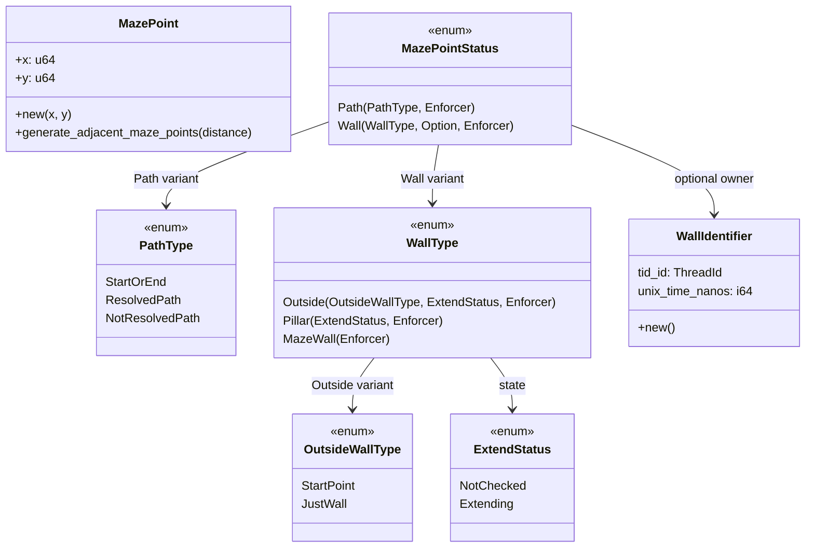
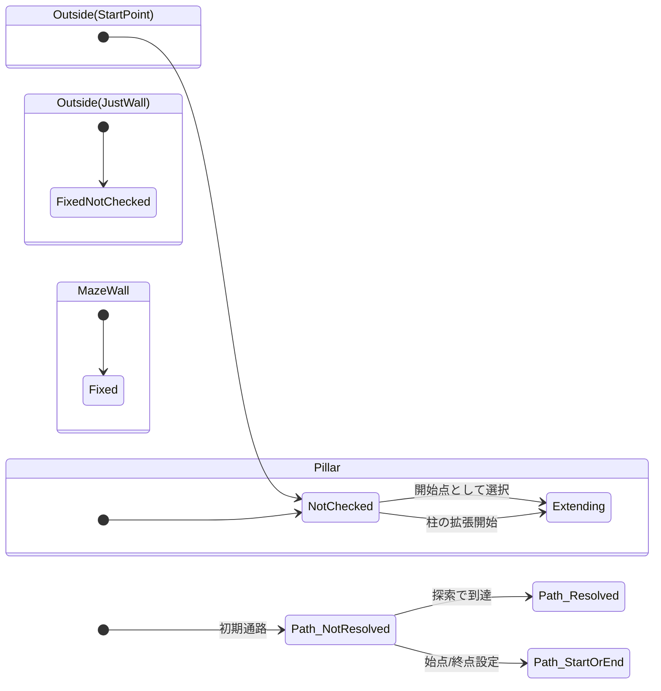
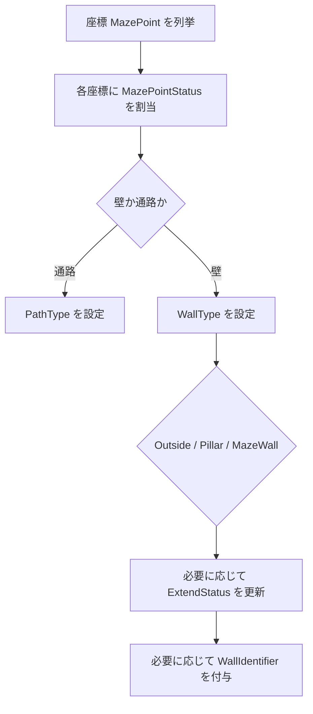

# maze_cell データ構造 図解まとめ

## 1. 全体構造（型の階層）

## 2. 役割の分担（要点）

- MazePoint
  - 座標そのものを表す値オブジェクト。
  - 近傍座標の生成や、座標計算の基盤を担当。
- MazePointStatus
  - 1マスの最上位状態。
  - 通路か壁かをまず決める「親の型」。
- PathType
  - 通路の意味付け。
  - 始点/終点、探索済み、未探索を区別。
- WallType
  - 壁の意味付け。
  - 外壁、柱、通常迷路壁を区別。
- OutsideWallType
  - 外壁の中でも「開始点候補」か「ただの境界壁」かを区別。
- ExtendStatus
  - 拡張アルゴリズム上の進行状態。
  - 未処理か、拡張中かを表す。
- WallIdentifier
  - 壁の所有者/生成元を追跡する識別子。
  - マルチスレッド時の由来管理に使う。

## 3. 状態遷移（壁生成の流れ）

## 4. 実行時イメージ（簡易フロー）

## 5. 一言でいうと

- 設計の芯は「1マス状態を MazePointStatus で統一し、その中で通路と壁をさらに型で細分化する」ことです。
- これにより、迷路生成ロジックが型で安全に分岐でき、並列処理時の所有者管理まで表現できる構造になっています。
